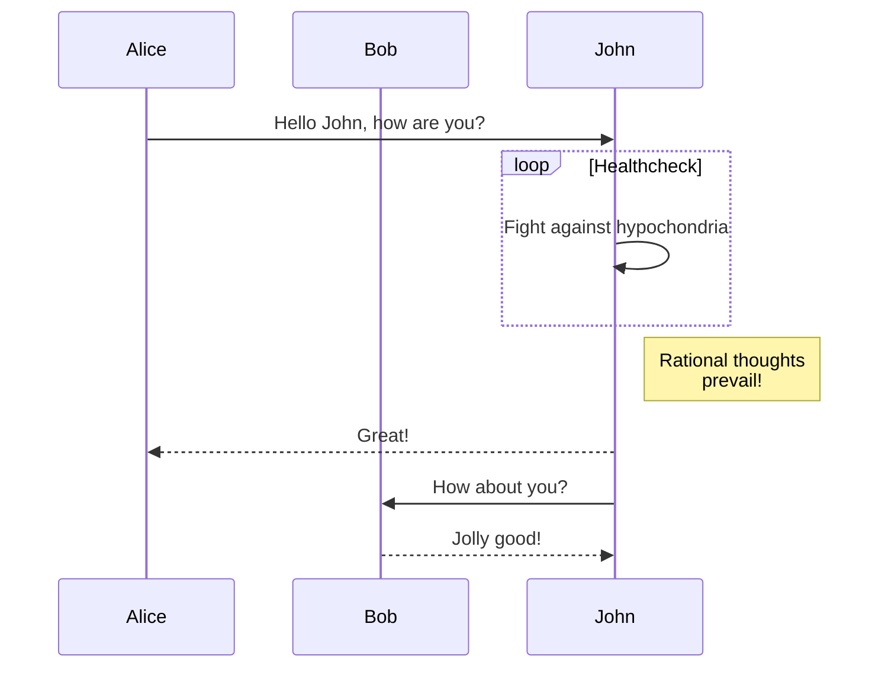

## GoAT diagrams (ASCII)

Hugo natively supports [GoAT] diagrams with an [embedded code block render hook]. This means that this code block:

[GoAT]: https://github.com/bep/goat
[embedded code block render hook]: {}

````txt
```goat
      .               .                .               .--- 1          .-- 1     / 1
     / \              |                |           .---+            .-+         +
    /   \         .---+---.         .--+--.        |   '--- 2      |   '-- 2   / \ 2
   +     +        |       |        |       |    ---+            ---+          +
  / \   / \     .-+-.   .-+-.     .+.     .+.      |   .--- 3      |   .-- 3   \ / 3
 /   \ /   \    |   |   |   |    |   |   |   |     '---+            '-+         +
 1   2 3   4    1   2   3   4    1   2   3   4         '--- 4          '-- 4     \ 4

```
````

Will be rendered as:

```goat

          .               .                .               .--- 1          .-- 1     / 1
         / \              |                |           .---+            .-+         +
        /   \         .---+---.         .--+--.        |   '--- 2      |   '-- 2   / \ 2
       +     +        |       |        |       |    ---+            ---+          +
      / \   / \     .-+-.   .-+-.     .+.     .+.      |   .--- 3      |   .-- 3   \ / 3
     /   \ /   \    |   |   |   |    |   |   |   |     '---+            '-+         +
     1   2 3   4    1   2   3   4    1   2   3   4         '--- 4          '-- 4     \ 4
```

## Mermaid diagrams

Hugo does not provide a built-in template for Mermaid diagrams. Create your own using a [code block render hook]:

[code block render hook]: /render-hooks/code-blocks/


<pre class="mermaid">
  {{- .Inner | safeHTML }}
</pre>
{{ .Page.Store.Set "hasMermaid" true }}


And then include this snippet at the bottom of the content template:

```go-html-template
{{ if .Store.Get "hasMermaid" }}
  <script type="module">
    import mermaid from 'https://cdn.jsdelivr.net/npm/mermaid/dist/mermaid.esm.min.mjs';
    mermaid.initialize({ startOnLoad: true });
  </script>
{{ end }}
```

With that you can use the `mermaid` language in Markdown code blocks:

````text

````

## Goat ASCII diagram examples

### Graphics

```goat
                                                                             .
    0       3                          P *              Eye /         ^     /
     *-------*      +y                    \                +)          \   /  Reflection
  1 /|    2 /|       ^                     \                \           \ v
   *-------* |       |                v0    \       v3           --------*--------
   | |4    | |7      |                  *----\-----*
   | *-----|-*       +-----> +x        /      v X   \          .-.<--------        o
   |/      |/       /                 /        o     \        | / | Refraction    / \
   *-------*       v                 /                \        +-'               /   \
  5       6      +z              v1 *------------------* v2    |                o-----o
                                                               v

```

### Complex

```goat
+-------------------+                           ^                      .---.
|    A Box          |__.--.__    __.-->         |      .-.             |   |
|                   |        '--'               v     | * |<---        |   |
+-------------------+                                  '-'             |   |
                       Round                                       *---(-. |
  .-----------------.  .-------.    .----------.         .-------.     | | |
 |   Mixed Rounded  | |         |  / Diagonals  \        |   |   |     | | |
 | & Square Corners |  '--. .--'  /              \       |---+---|     '-)-'       .--------.
 '--+------------+-'  .--. |     '-------+--------'      |   |   |       |        / Search /
    |            |   |    | '---.        |               '-------'       |       '-+------'
    |<---------->|   |    |      |       v                Interior                 |     ^
    '           <---'      '----'   .-----------.              ---.     .---       v     |
 .------------------.  Diag line    | .-------. +---.              \   /           .     |
 |   if (a > b)     +---.      .--->| |       | |    | Curved line  \ /           / \    |
 |   obj->fcn()     |    \    /     | '-------' |<--'                +           /   \   |
 '------------------'     '--'      '--+--------'      .--. .--.     |  .-.     +Done?+-'
    .---+-----.                        |   ^           |\ | | /|  .--+ |   |     \   /
    |   |     | Join        \|/        |   | Curved    | \| |/ | |    \    |      \ /
    |   |     +---->  o    --o--        '-'  Vertical  '--' '--'  '--  '--'        +  .---.
 <--+---+-----'       |     /|\                                                    |  | 3 |
                      v                             not:line    'quotes'        .-'   '---'
  .-.             .---+--------.            /            A || B   *bold*       |        ^
 |   |           |   Not a dot  |      <---+---<--    A dash--is not a line    v        |
  '-'             '---------+--'          /           Nor/is this.            ---

```

### Process

```goat
                                      .
   .---------.                       / \
  |   START   |                     /   \        .-+-------+-.      ___________
   '----+----'    .-------.    A   /     \   B   | |COMPLEX| |     /           \      .-.
        |        |   END   |<-----+CHOICE +----->| |       | +--->+ PREPARATION +--->| X |
        v         '-------'        \     /       | |PROCESS| |     \___________/      '-'
    .---------.                     \   /        '-+---+---+-'
   /  INPUT  /                       \ /
  '-----+---'                         '
        |                             ^
        v                             |
  .-----------.                 .-----+-----.        .-.
  |  PROCESS  +---------------->|  PROCESS  |<------+ X |
  '-----------'                 '-----------'        '-'
```

### File tree

Created from <https://arthursonzogni.com/Diagon/#Tree>

```goat  { width=300  color="orange" }
───Linux─┬─Android
         ├─Debian─┬─Ubuntu─┬─Lubuntu
         │        │        ├─Kubuntu
         │        │        ├─Xubuntu
         │        │        └─Xubuntu
         │        └─Mint
         ├─Centos
         └─Fedora
```

### Sequence diagram

<https://arthursonzogni.com/Diagon/#Sequence>

```goat { class="w-40" }
┌─────┐       ┌───┐
│Alice│       │Bob│
└──┬──┘       └─┬─┘
   │            │  
   │ Hello Bob! │  
   │───────────>│  
   │            │  
   │Hello Alice!│  
   │<───────────│  
┌──┴──┐       ┌─┴─┐
│Alice│       │Bob│
└─────┘       └───┘

```

### Flowchart

<https://arthursonzogni.com/Diagon/#Flowchart>

```goat
   _________________                                                              
  ╱                 ╲                                                     ┌─────┐ 
 ╱ DO YOU UNDERSTAND ╲____________________________________________________│GOOD!│ 
 ╲ FLOW CHARTS?      ╱yes                                                 └──┬──┘ 
  ╲_________________╱                                                        │    
           │no                                                               │    
  _________▽_________                    ______________________              │    
 ╱                   ╲                  ╱                      ╲    ┌────┐   │    
╱ OKAY, YOU SEE THE   ╲________________╱ ... AND YOU CAN SEE    ╲___│GOOD│   │    
╲ LINE LABELED 'YES'? ╱yes             ╲ THE ONES LABELED 'NO'? ╱yes└──┬─┘   │    
 ╲___________________╱                  ╲______________________╱       │     │    
           │no                                     │no                 │     │    
   ________▽_________                     _________▽__________         │     │    
  ╱                  ╲    ┌───────────┐  ╱                    ╲        │     │    
 ╱ BUT YOU SEE THE    ╲___│WAIT, WHAT?│ ╱ BUT YOU JUST         ╲___    │     │    
 ╲ ONES LABELED 'NO'? ╱yes└───────────┘ ╲ FOLLOWED THEM TWICE? ╱yes│   │     │    
  ╲__________________╱                   ╲____________________╱    │   │     │    
           │no                                     │no             │   │     │    
       ┌───▽───┐                                   │               │   │     │    
       │LISTEN.│                                   └───────┬───────┘   │     │    
       └───┬───┘                                    ┌──────▽─────┐     │     │    
     ┌─────▽────┐                                   │(THAT WASN'T│     │     │    
     │I HATE YOU│                                   │A QUESTION) │     │     │    
     └──────────┘                                   └──────┬─────┘     │     │    
                                                      ┌────▽───┐       │     │    
                                                      │SCREW IT│       │     │    
                                                      └────┬───┘       │     │    
                                                           └─────┬─────┘     │    
                                                                 │           │    
                                                                 └─────┬─────┘    
                                                               ┌───────▽──────┐   
                                                               │LET'S GO DRING│   
                                                               └───────┬──────┘   
                                                             ┌─────────▽─────────┐
                                                             │HEY, I SHOULD TRY  │
                                                             │INSTALLING FREEBSD!│
                                                             └───────────────────┘

```

### Table

<https://arthursonzogni.com/Diagon/#Table>

```goat { class="w-80 dark-blue" }
┌────────────────────────────────────────────────┐
│                                                │
├────────────────────────────────────────────────┤
│SYNTAX     = { PRODUCTION } .                   │
├────────────────────────────────────────────────┤
│PRODUCTION = IDENTIFIER "=" EXPRESSION "." .    │
├────────────────────────────────────────────────┤
│EXPRESSION = TERM { "|" TERM } .                │
├────────────────────────────────────────────────┤
│TERM       = FACTOR { FACTOR } .                │
├────────────────────────────────────────────────┤
│FACTOR     = IDENTIFIER                         │
├────────────────────────────────────────────────┤
│          | LITERAL                             │
├────────────────────────────────────────────────┤
│          | "[" EXPRESSION "]"                  │
├────────────────────────────────────────────────┤
│          | "(" EXPRESSION ")"                  │
├────────────────────────────────────────────────┤
│          | "{" EXPRESSION "}" .                │
├────────────────────────────────────────────────┤
│IDENTIFIER = letter { letter } .                │
├────────────────────────────────────────────────┤
│LITERAL    = """" character { character } """" .│
└────────────────────────────────────────────────┘
```
