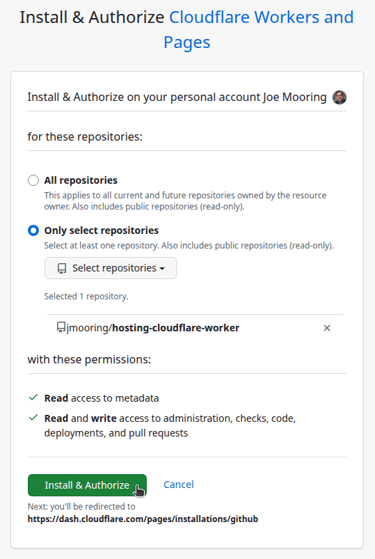
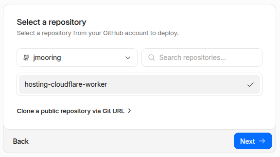
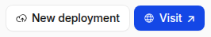

Use these instructions to enable continuous deployment from a GitHub repository. The same general steps apply if you are using GitLab for version control.

{}

## Prerequisites

Please complete the following tasks before continuing:

1. [Create](https://dash.cloudflare.com/sign-up) a Cloudflare account.
1. [Log in](https://dash.cloudflare.com/login) to your Cloudflare account.
1. [Create](https://github.com/signup) a GitHub account.
1. [Log in](https://github.com/login) to your GitHub account.
1. [Create](https://github.com/new) a GitHub repository for your project.
1. [Create](https://git-scm.com/docs/git-init) a local Git repository for your project with a [remote][] reference to your GitHub repository.
1. Create a Hugo project within your local Git repository and test it with the `hugo server` command.
1. Commit the changes to your local Git repository and push to your GitHub repository.

## Procedure

Step 1
: Create a `wrangler.toml` file in the root of your project.

  ```toml {file="wrangler.toml" copy=true}
  name = 'hosting-cloudflare-worker'
  compatibility_date = '2025-07-31'

  [build]
  command = 'chmod a+x build.sh && ./build.sh'

  [assets]
  directory = './public'
  not_found_handling = '404-page'
  ```

Step 2
: Create a `build.sh` file in the root of your project.

  ```sh {file="build.sh" copy=true}
  #!/usr/bin/env bash

  #------------------------------------------------------------------------------
  # @file
  # Builds a Hugo site hosted on a Cloudflare Worker.
  #------------------------------------------------------------------------------

  # Exit on error, undefined variables, or pipe failures
  set -euo pipefail

  build_temp_dir=""

  # Perform cleanup
  cleanup() {
    if [[ -n "${build_temp_dir}" && -d "${build_temp_dir}" ]]; then
      rm -rf "${build_temp_dir}"
    fi
  }

  # Register the cleanup trap
  trap cleanup EXIT SIGINT SIGTERM

  main() {
    # Define tool versions
    DART_SASS_VERSION=1.101.0
    GO_VERSION=1.26.4
    HUGO_VERSION=0.163.2
    NODE_VERSION=24.16.0

    # Set the build timezone
    export TZ=Europe/Oslo

    # Set the build cache directory
    export HUGO_CACHEDIR="${PWD}/.cache/hugo_cache"

    # Create and move into a temporary directory for downloads
    build_temp_dir=$(mktemp -d)
    pushd "${build_temp_dir}" > /dev/null

    # Create the local tools directory
    mkdir -p "${HOME}/.local"

    # Install Dart Sass
    echo "Installing Dart Sass ${DART_SASS_VERSION}..."
    curl -sLO "https://github.com/sass/dart-sass/releases/download/${DART_SASS_VERSION}/dart-sass-${DART_SASS_VERSION}-linux-x64.tar.gz"
    tar -C "${HOME}/.local" -xf "dart-sass-${DART_SASS_VERSION}-linux-x64.tar.gz"
    export PATH="${HOME}/.local/dart-sass:${PATH}"

    # Install Go
    echo "Installing Go ${GO_VERSION}..."
    curl -sLO "https://go.dev/dl/go${GO_VERSION}.linux-amd64.tar.gz"
    tar -C "${HOME}/.local" -xf "go${GO_VERSION}.linux-amd64.tar.gz"
    export PATH="${HOME}/.local/go/bin:${PATH}"

    # Install Hugo
    echo "Installing Hugo ${HUGO_VERSION}..."
    curl -sLO "https://github.com/gohugoio/hugo/releases/download/v${HUGO_VERSION}/hugo_${HUGO_VERSION}_linux-amd64.tar.gz"
    mkdir -p "${HOME}/.local/hugo"
    tar -C "${HOME}/.local/hugo" -xf "hugo_${HUGO_VERSION}_linux-amd64.tar.gz"
    export PATH="${HOME}/.local/hugo:${PATH}"

    # Install Node.js
    echo "Installing Node.js ${NODE_VERSION}..."
    curl -sLO "https://nodejs.org/dist/v${NODE_VERSION}/node-v${NODE_VERSION}-linux-x64.tar.xz"
    tar -C "${HOME}/.local" -xf "node-v${NODE_VERSION}-linux-x64.tar.xz"
    export PATH="${HOME}/.local/node-v${NODE_VERSION}-linux-x64/bin:${PATH}"

    # Return to the project root
    popd > /dev/null

    # Verify installations
    echo "Verifying installations..."
    echo Dart Sass: "$(sass --version)"
    echo Go: "$(go version)"
    echo Hugo: "$(hugo version)"
    echo Node.js: "$(node --version)"

    # Configure Git
    echo "Configuring Git..."
    git config --global core.quotepath false
    if [ "$(git rev-parse --is-shallow-repository)" = "true" ]; then
      git fetch --unshallow
    fi

    # Install Node.js dependencies
    if [ -f package-lock.json ]; then
      echo "Installing Node.js dependencies..."
      npm ci
    fi

    # Build the site
    echo "Building the site..."
    hugo build --gc --minify
  }

  main "$@"
  ```

Step 3
: Commit the changes to your local Git repository and push to your GitHub repository.

Step 4
: In the upper right corner of the Cloudflare [dashboard][], press the **Add** button and select "Workers" from the drop down menu.

  

Step 5
: Verify your account if prompted.

  

Step 6
: On the "Create a Worker" page, under the "Ship something new" heading, press the **Connect GitHub** button.

  

Step 7
: Select the GitHub account where you want to install the Cloudflare Workers and Pages application.

  

Step 8
: Authorize the Cloudflare Workers and Pages application to access all repositories or only select repositories, then press the **Install & Authorize** button.

  

Step 9
: On the "Create a Worker" page, under the "Select a repository" heading, select the repository to deploy, then press the **Next** button.

  

Step 10
: On the "Create a Worker" page, under the "Set up your application" heading, perform the following steps:

  1. Provide a **Project name**.
  1. Leave the **Build command** blank and ensure the **Deploy command** is `npx wrangler deploy`.
  1. Expand the **Advanced settings** panel.
  1. In the **Variable name** field, enter `SKIP_DEPENDENCY_INSTALL`.
  1. In the **Variable value** field, enter `true`.
  1. Press the **Deploy** button.

Step 11
: Wait for the site to build and deploy, then press the **Visit** button in the upper left corner of your screen.

  

In the future, whenever you push a change from your local Git repository, Cloudflare will rebuild and deploy your site.

## Build cache

The build script shown in [Step 2](#step-2) sets Hugo's [cache directory][] to the path required by Cloudflare's build cache, which is disabled by default. To enable the Cloudflare build cache:

1. Navigate to Workers & Pages Overview on the [dashboard][].
1. Find your Workers project.
1. Go to **Settings** > **Build** > **Build cache**.
1. Press the **Enable** button.

[cache directory]: /configuration/all/#cache-directory
[dashboard]: https://dash.cloudflare.com/
[remote]: https://git-scm.com/docs/git-remote
