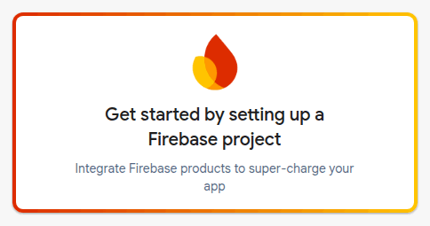
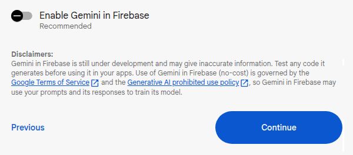
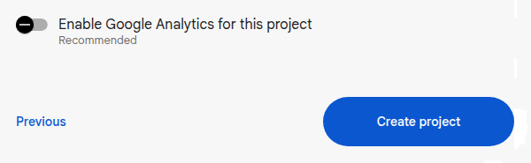
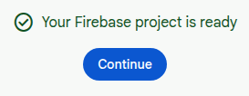
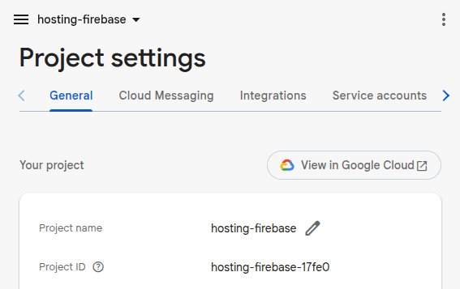
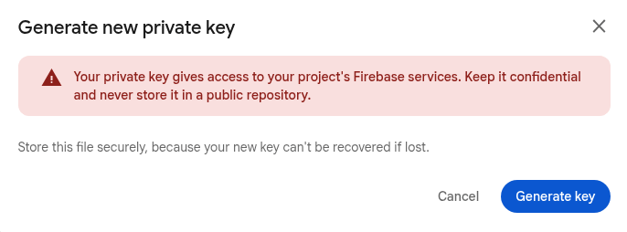
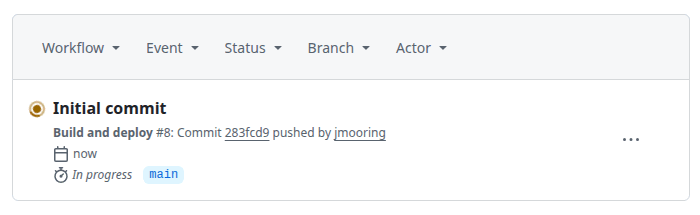
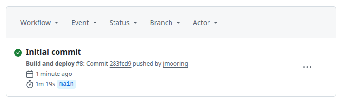

Use these instructions to enable continuous deployment from a GitHub repository. The same general steps apply for other Git providers such as GitLab or Bitbucket.

{}

## Prerequisites

Please complete the following tasks before continuing:

1. [Create](https://accounts.google.com/) a Google account.
1. [Log in](https://accounts.google.com/) to your Google account.
1. [Create](https://github.com/signup) a GitHub account.
1. [Log in](https://github.com/login) to your GitHub account.
1. [Create](https://github.com/new) a GitHub repository for your project.
1. [Create](https://git-scm.com/docs/git-init) a local Git repository for your project with a [remote][] reference to your GitHub repository.
1. Create a Hugo project within your local Git repository and test it with the `hugo server` command.
1. Commit the changes to your local Git repository and push to your GitHub repository.

## Procedure

Step 1
: Create a Firebase project.

  1. Visit the [Firebase console][].

  1. Click **Get started by setting up a Firebase project**.

      

  1. Enter your project name and, if your Google account is associated with a Google Workspace or Cloud Identity organization, select a parent resource. Then press the **Continue** button.

      

  1. Disable Gemini for this project, then press the **Continue** button.

      

  1. Disable Google Analytics for this project, then press the **Create project** button.

      

  1. When your Firebase project is ready, press the **Continue** button.

      

  1. From the sidebar menu, choose **Settings** > **General** and note the Project ID. You will need the Project ID later in this procedure.

      

  1. From the sidebar menu, choose **Settings** > **Service accounts**. At the bottom of the page, press the **Generate new private key** button, then press the **Generate key** button.

        

  1. Download the generated JSON file to any location outside of your project directory.

Step 2
: Add the private key to GitHub Secrets.

  1. Go to your GitHub repository.
  1. Navigate to **Settings** > **Secrets and variables** > **Actions**.
  1. Click the **New repository secret** button.
  1. Enter `FIREBASE_SERVICE_ACCOUNT_KEY` for the Name.
  1. Paste the contents of the downloaded JSON file into the Secret field.
  1. Press the **Add secret** button.
  1. Delete the downloaded JSON file.

Step 3
: Create a `hugo.yaml` file in the `.github/workflows` directory, adjusting the tool versions and time zone as needed. Set the `FIREBASE_PROJECT_ID` to the Project ID that you noted earlier in this procedure.

  ```yaml {file=".github/workflows/hugo.yaml" copy=true}
  name: Build and deploy
  env:
    # Define tool versions
    DART_SASS_VERSION: 1.104.0
    GO_VERSION: 1.27.0
    HUGO_VERSION: 0.166.0
    NODE_VERSION: 24.20.0

    # Set the build time zone
    TZ: Europe/Oslo

    # Set the Firebase Project ID.
    FIREBASE_PROJECT_ID: hosting-firebase-17fe0
  on:
    push:
      branches:
        - main
    workflow_dispatch:
  permissions:
    contents: read
    pull-requests: write
  concurrency:
    group: deployment
    cancel-in-progress: false
  defaults:
    run:
      shell: bash
  jobs:
    build:
      runs-on: ubuntu-latest
      steps:
        - name: Checkout
          uses: actions/checkout@v7
          with:
            submodules: recursive
            fetch-depth: 0
            lfs: false

        - name: Create a local tools directory
          run: |
            mkdir -p "${HOME}/.local"

        - name: Install Go
          if: hashFiles('go.mod') != ''
          uses: actions/setup-go@v7
          with:
            go-version: ${{ env.GO_VERSION }}
            cache: false

        - name: Install Node.js
          if: hashFiles('package-lock.json') != ''
          uses: actions/setup-node@v7
          with:
            node-version: ${{ env.NODE_VERSION }}

        - name: Install Dart Sass
          run: |
            echo "Installing Dart Sass ${DART_SASS_VERSION}..."
            curl -sfL --output-dir "${{ runner.temp }}" -O "https://github.com/sass/dart-sass/releases/download/${DART_SASS_VERSION}/dart-sass-${DART_SASS_VERSION}-linux-x64.tar.gz"
            tar -C "${HOME}/.local" -xf "${{ runner.temp }}/dart-sass-${DART_SASS_VERSION}-linux-x64.tar.gz"
            echo "${HOME}/.local/dart-sass" >> "${GITHUB_PATH}"

        - name: Install Hugo
          run: |
            echo "Installing Hugo ${HUGO_VERSION}..."
            curl -sfL --output-dir "${{ runner.temp }}" -O "https://github.com/gohugoio/hugo/releases/download/v${HUGO_VERSION}/hugo_${HUGO_VERSION}_linux-amd64.tar.gz"
            mkdir "${HOME}/.local/hugo"
            tar -C "${HOME}/.local/hugo" -xf "${{ runner.temp }}/hugo_${HUGO_VERSION}_linux-amd64.tar.gz"
            echo "${HOME}/.local/hugo" >> "${GITHUB_PATH}"

        - name: Log tool versions
          run: |
            echo "Logging tool versions..."
            command -v sass &> /dev/null && echo "Dart Sass: $(sass --version)" || echo "Dart Sass: not installed"
            command -v go &> /dev/null && echo "Go: $(go version)" || echo "Go: not installed"
            command -v hugo &> /dev/null && echo "Hugo: $(hugo version)" || echo "Hugo: not installed"
            command -v node &> /dev/null && echo "Node.js: $(node --version)" || echo "Node.js: not installed"

        - name: Configure Git
          run: |
            echo "Configuring Git..."
            git config --global core.quotepath false

        - name: Fetch full Git history
          run: |
            if [[ $(git rev-parse --is-shallow-repository) == true ]]; then
              echo "Fetching full Git history..."
              git fetch --unshallow
            fi

        - name: Initialize Git submodules
          run: |
            if [[ -f .gitmodules ]]; then
              echo "Initializing Git submodules..."
              git submodule update --init --recursive
            fi

        - name: Install Node.js dependencies
          run: |
            if [[ -f package-lock.json ]]; then
              echo "Installing Node.js dependencies..."
              npm ci
            fi

        - name: Cache restore
          id: cache-restore
          uses: actions/cache/restore@v6
          with:
            path: ${{ runner.temp }}/.cache/hugo
            key: hugo-${{ github.run_id }}
            restore-keys: hugo-

        - name: Build
          run: |
            echo "Building the project..."
            hugo build \
              --gc \
              --minify \
              --cacheDir "${{ runner.temp }}/.cache/hugo"

        - name: Cache save
          uses: actions/cache/save@v6
          with:
            path: ${{ runner.temp }}/.cache/hugo
            key: ${{ steps.cache-restore.outputs.cache-primary-key }}

        - name: Upload build artifact
          uses: actions/upload-artifact@v7
          with:
            name: build-artifact
            path: public
            retention-days: 1
    deploy:
      needs: build
      runs-on: ubuntu-latest
      steps:
        - name: Download build artifact
          uses: actions/download-artifact@v8
          with:
            name: build-artifact
            path: public

        - name: Create Firebase Hosting config
          run: |
            cat << 'EOF' > firebase.json
            {
              "hosting": {
                "public": "public"
              }
            }
            EOF

        - name: Setup Node.js
          uses: actions/setup-node@v7
          with:
            node-version: ${{ env.NODE_VERSION }}

        - name: Install Firebase CLI
          run: npm install -g firebase-tools --no-fund --no-audit --quiet

        - name: Deploy
          env:
            FIREBASE_SERVICE_ACCOUNT_KEY: ${{ secrets.FIREBASE_SERVICE_ACCOUNT_KEY }}
          run: |
            echo "$FIREBASE_SERVICE_ACCOUNT_KEY" > "${RUNNER_TEMP}/gcp_key.json"
            export GOOGLE_APPLICATION_CREDENTIALS="${RUNNER_TEMP}/gcp_key.json"
            firebase deploy --only hosting --project "${FIREBASE_PROJECT_ID}"
  ```

Step 4
: In the project configuration file in the root of your local Git repository, set the [`baseURL`][] to the assigned URL as shown below. The assigned URL is composed of the Project ID that you noted earlier in this procedure, followed by the `web.app` domain name.

  
  baseURL = 'https://hosting-firebase-17fe0.web.app/'
  locale  = 'en-US'
  title   = 'Hosting Test - Firebase'
  

Step 5
: In the project configuration file in the root of your local Git repository, set the location of the image cache to the [`cacheDir`][] as shown below.

  
  [caches.images]
  dir = ':cacheDir/images'
  

  See [configure file caches][] for more information.

Step 6
: Commit the changes to your local Git repository and push to your GitHub repository.

Step 7
: From GitHub's main menu, choose **Actions**. You will see something like this:

  

Step 8
: When GitHub has finished building and deploying your site, the color of the status indicator will change to green.

  

In the future, whenever you push a change from your local Git repository, GitHub will rebuild and deploy your site.

## Related resources

For more information on hosting and managing your site with Firebase Hosting, consult the official documentation:

- [General documentation][]
- [Custom domain setup][]

[Custom domain setup]: https://firebase.google.com/docs/hosting/custom-domain
[Firebase console]: https://console.firebase.google.com/
[General documentation]: https://firebase.google.com/docs/hosting
[`baseURL`]: /configuration/all/#baseurl
[`cacheDir`]: /configuration/all/#cachedir
[configure file caches]: /configuration/caches/
[remote]: https://git-scm.com/docs/git-remote
