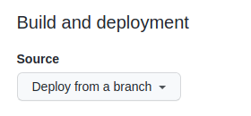

## Prerequisites

Please complete the following tasks before continuing:

1. [Create a GitHub account]
1. [Install Git]
1. [Create a Hugo site] and test it locally with `hugo server`.

## Types of sites

There are three types of GitHub Pages sites: project, user, and organization. Project sites are connected to a specific project hosted on GitHub. User and organization sites are connected to a specific account on GitHub.com.

> [!note]
> See the [GitHub Pages documentation] to understand the requirements for repository ownership and naming.

## Procedure

### Step 1

Create a GitHub repository.

### Step 2

Push your local repository to GitHub.

### Step 3

Visit your GitHub repository. From the main menu choose **Settings**&nbsp;>&nbsp;**Pages**. In the center of your screen you will see this:


{style="max-width: 280px"}

### Step 4

Change the **Source** to `GitHub Actions`. The change is immediate; you do not have to press a Save button.


{style="max-width: 280px"}

### Step 5

In your site configuration, change the location of the image cache to the [`cacheDir`] as shown below:


[caches.images]
dir = ":cacheDir/images"


See [configure file caches] for more information.

### Step 6

Create a file named `hugo.yaml` in a directory named `.github/workflows`.

```text
mkdir -p .github/workflows
touch .github/workflows/hugo.yaml
```

### Step 7

> [!note]
> The workflow below ensures Hugo's `cacheDir` is persistent, preserving modules, processed images, and [`resources.GetRemote`] data between builds.

Copy and paste the YAML below into the file you created. Change the branch name and Hugo version as needed.

```yaml {file=".github/workflows/hugo.yaml" copy=true}
# Sample workflow for building and deploying a Hugo site to GitHub Pages
name: Deploy Hugo site to Pages

on:
  # Runs on pushes targeting the default branch
  push:
    branches:
      - main

  # Allows you to run this workflow manually from the Actions tab
  workflow_dispatch:

# Sets permissions of the GITHUB_TOKEN to allow deployment to GitHub Pages
permissions:
  contents: read
  pages: write
  id-token: write

# Allow only one concurrent deployment, skipping runs queued between the run in-progress and latest queued.
# However, do NOT cancel in-progress runs as we want to allow these production deployments to complete.
concurrency:
  group: "pages"
  cancel-in-progress: false

# Default to bash
defaults:
  run:
    shell: bash

jobs:
  # Build job
  build:
    runs-on: ubuntu-latest
    env:
      DART_SASS_VERSION: 1.89.2
      HUGO_VERSION: 0.147.9
      HUGO_ENVIRONMENT: production
      TZ: America/Los_Angeles
    steps:
      - name: Install Hugo CLI
        run: |
          wget -O ${{ runner.temp }}/hugo.deb https://github.com/gohugoio/hugo/releases/download/v${HUGO_VERSION}/hugo_extended_${HUGO_VERSION}_linux-amd64.deb \
          && sudo dpkg -i ${{ runner.temp }}/hugo.deb
      - name: Install Dart Sass
        run: |
          wget -O ${{ runner.temp }}/dart-sass.tar.gz https://github.com/sass/dart-sass/releases/download/${DART_SASS_VERSION}/dart-sass-${DART_SASS_VERSION}-linux-x64.tar.gz \
          && tar -xf ${{ runner.temp }}/dart-sass.tar.gz --directory ${{ runner.temp }} \
          && mv ${{ runner.temp }}/dart-sass/ /usr/local/bin \
          && echo "/usr/local/bin/dart-sass" >> $GITHUB_PATH
      - name: Checkout
        uses: actions/checkout@v4
        with:
          submodules: recursive
          fetch-depth: 0
      - name: Setup Pages
        id: pages
        uses: actions/configure-pages@v5
      - name: Install Node.js dependencies
        run: "[[ -f package-lock.json || -f npm-shrinkwrap.json ]] && npm ci || true"
      - name: Cache Restore
        id: cache-restore
        uses: actions/cache/restore@v4
        with:
          path: |
            ${{ runner.temp }}/hugo_cache
          key: hugo-${{ github.run_id }}
          restore-keys:
            hugo-
      - name: Configure Git
        run: git config core.quotepath false
      - name: Build with Hugo
        run: |
          hugo \
            --gc \
            --minify \
            --baseURL "${{ steps.pages.outputs.base_url }}/" \
            --cacheDir "${{ runner.temp }}/hugo_cache"
      - name: Cache Save
        id: cache-save
        uses: actions/cache/save@v4
        with:
          path: |
            ${{ runner.temp }}/hugo_cache
          key: ${{ steps.cache-restore.outputs.cache-primary-key }}
      - name: Upload artifact
        uses: actions/upload-pages-artifact@v3
        with:
          path: ./public

  # Deployment job
  deploy:
    environment:
      name: github-pages
      url: ${{ steps.deployment.outputs.page_url }}
    runs-on: ubuntu-latest
    needs: build
    steps:
      - name: Deploy to GitHub Pages
        id: deployment
        uses: actions/deploy-pages@v4
```

### Step 8

Commit and push the change to your GitHub repository.

```sh
git add -A
git commit -m "Create hugo.yaml"
git push
```

### Step 9

From GitHub's main menu, choose **Actions**. You will see something like this:


{style="max-width: 350px"}

### Step 10

When GitHub has finished building and deploying your site, the color of the status indicator will change to green.


{style="max-width: 350px"}

### Step 11

Click on the commit message as shown above. You will see this:


{style="max-width: 611px"}

Under the deploy step, you will see a link to your live site.

In the future, whenever you push a change from your local repository, GitHub will rebuild your site and deploy the changes.

## Customize the workflow

The example workflow above includes this step, which typically takes 10&#8209;15 seconds:

```yaml
- name: Install Dart Sass
  run: sudo snap install dart-sass
```

You may remove this step if your site, themes, and modules do not transpile Sass to CSS using the [Dart Sass] transpiler.

## Other resources

- [Learn more about GitHub Actions](https://docs.github.com/en/actions)
- [Caching dependencies to speed up workflows](https://docs.github.com/en/actions/using-workflows/caching-dependencies-to-speed-up-workflows)
- [Manage a custom domain for your GitHub Pages site](https://docs.github.com/en/pages/configuring-a-custom-domain-for-your-github-pages-site/about-custom-domains-and-github-pages)

[Create a GitHub account]: https://github.com/signup
[Create a Hugo site]: /getting-started/quick-start/
[Dart Sass]: /functions/css/sass/#dart-sass
[GitHub Pages documentation]: https://docs.github.com/en/pages/getting-started-with-github-pages/about-github-pages#types-of-github-pages-sites
[Install Git]: https://git-scm.com/book/en/v2/Getting-Started-Installing-Git
[`cacheDir`]: /configuration/all/#cachedir
[`resources.GetRemote`]: /functions/resources/getremote/
[configure file caches]: /configuration/caches/
