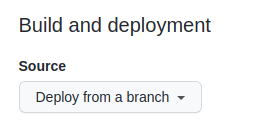
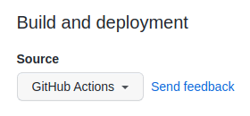
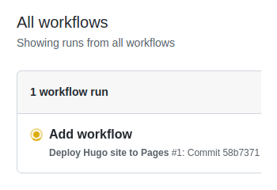
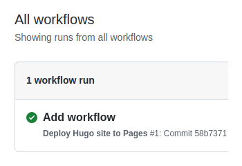
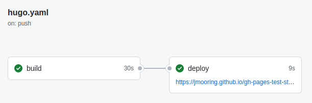

Use these instructions to enable continuous deployment from a GitHub repository to GitHub Pages.

{}

## Types of sites

There are three types of GitHub Pages sites: project, user, and organization. Project sites are connected to a specific project hosted on GitHub. User and organization sites are connected to a specific account on GitHub.com.

> [!NOTE]
> See the [GitHub Pages documentation][] to understand the requirements for repository ownership and naming.

## Prerequisites

Please complete the following tasks before continuing:

1. [Create](https://github.com/signup) a GitHub account.
1. [Log in][] to your GitHub account.
1. [Create](https://github.com/new) a GitHub repository for your project.
1. [Create](https://git-scm.com/docs/git-init) a local Git repository for your project with a [remote][] reference to your GitHub repository.
1. Create a Hugo project within your local Git repository and test it with the `hugo server` command.
1. Commit the changes to your local Git repository and push to your GitHub repository.

## Procedure

Step 1
: Visit your GitHub repository. From the main menu choose **Settings**&nbsp;>&nbsp;**Pages**. In the center of your screen you will see this:

  

  Change the **Source** to `GitHub Actions`. The change is immediate; you do not have to press a Save button.

  

Step 2
: Create a `hugo.yaml` file in the `.github/workflows` directory, adjusting the tool versions and time zone as needed.

  ```yaml {file=".github/workflows/hugo.yaml" copy=true}
  name: Build and deploy
  on:
    push:
      branches:
        - main
    workflow_dispatch:
  permissions:
    contents: read
    pages: write
    id-token: write
  concurrency:
    group: pages
    cancel-in-progress: false
  defaults:
    run:
      shell: bash
  jobs:
    build:
      runs-on: ubuntu-latest
      env:
        # Define tool versions
        DART_SASS_VERSION: 1.101.0
        GO_VERSION: 1.26.4
        HUGO_VERSION: 0.163.3
        NODE_VERSION: 24.16.0

        # Set the build time zone
        TZ: Europe/Oslo
      steps:
        - name: Checkout
          uses: actions/checkout@v6
          with:
            submodules: recursive
            fetch-depth: 0

        - name: Setup Pages
          id: pages
          uses: actions/configure-pages@v6

        - name: Create a local tools directory
          run: |
            mkdir -p "${HOME}/.local"

        - name: Install Go
          if: hashFiles('go.mod') != ''
          uses: actions/setup-go@v6
          with:
            go-version: ${{ env.GO_VERSION }}
            cache: false

        - name: Install Node.js
          if: hashFiles('package-lock.json') != ''
          uses: actions/setup-node@v6
          with:
            node-version: ${{ env.NODE_VERSION }}

        - name: Install Dart Sass
          run: |
            echo "Installing Dart Sass ${DART_SASS_VERSION}..."
            curl -sfL --output-dir "${{ runner.temp }}" -O "https://github.com/sass/dart-sass/releases/download/${DART_SASS_VERSION}/dart-sass-${DART_SASS_VERSION}-linux-x64.tar.gz"
            tar -C "${HOME}/.local" -xf "${{ runner.temp }}/dart-sass-${DART_SASS_VERSION}-linux-x64.tar.gz"
            echo "${HOME}/.local/dart-sass" >> "${GITHUB_PATH}"

        - name: Install Hugo
          run: |
            echo "Installing Hugo ${HUGO_VERSION}..."
            curl -sfL --output-dir "${{ runner.temp }}" -O "https://github.com/gohugoio/hugo/releases/download/v${HUGO_VERSION}/hugo_extended_${HUGO_VERSION}_linux-amd64.tar.gz"
            mkdir "${HOME}/.local/hugo"
            tar -C "${HOME}/.local/hugo" -xf "${{ runner.temp }}/hugo_extended_${HUGO_VERSION}_linux-amd64.tar.gz"
            echo "${HOME}/.local/hugo" >> "${GITHUB_PATH}"

        - name: Log tool versions
          run: |
            echo "Logging tool versions..."
            command -v sass &> /dev/null && echo "Dart Sass: $(sass --version)" || echo "Dart Sass: not installed"
            command -v go &> /dev/null && echo "Go: $(go version)" || echo "Go: not installed"
            command -v hugo &> /dev/null && echo "Hugo: $(hugo version)" || echo "Hugo: not installed"
            command -v node &> /dev/null && echo "Node.js: $(node --version)" || echo "Node.js: not installed"

        - name: Configure Git
          run: |
            echo "Configuring Git..."
            git config --global core.quotepath false

        - name: Fetch full Git history
          run: |
            if [[ $(git rev-parse --is-shallow-repository) == true ]]; then
              echo "Fetching full Git history..."
              git fetch --unshallow
            fi

        - name: Initialize Git submodules
          run: |
            if [[ -f .gitmodules ]]; then
              echo "Initializing Git submodules..."
              git submodule update --init --recursive
            fi

        - name: Install Node.js dependencies
          run: |
            if [[ -f package-lock.json ]]; then
              echo "Installing Node.js dependencies..."
              npm ci
            fi

        - name: Cache restore
          id: cache-restore
          uses: actions/cache/restore@v5
          with:
            path: ${{ runner.temp }}/hugo_cache
            key: hugo-${{ github.run_id }}
            restore-keys: hugo-

        - name: Build
          run: |
            echo "Building the project..."
            hugo build \
              --gc \
              --minify \
              --baseURL "${{ steps.pages.outputs.base_url }}/" \
              --cacheDir "${{ runner.temp }}/hugo_cache"

        - name: Cache save
          uses: actions/cache/save@v5
          with:
            path: ${{ runner.temp }}/hugo_cache
            key: ${{ steps.cache-restore.outputs.cache-primary-key }}

        - name: Upload artifact
          uses: actions/upload-pages-artifact@v5
          with:
            include-hidden-files: false
            path: ./public
    deploy:
      runs-on: ubuntu-latest
      needs: build
      environment:
        name: github-pages
        url: ${{ steps.deployment.outputs.page_url }}
      steps:
        - name: Deploy to GitHub Pages
          uses: actions/deploy-pages@v5
  ```

Step 3
: In your project configuration, change the location of the image cache to the [`cacheDir`][] as shown below:

  
  [caches.images]
  dir = ':cacheDir/images'
  

  See [configure file caches][] for more information.

Step 4
: Commit the changes to your local Git repository and push to your GitHub repository.

Step 5
: From GitHub's main menu, choose **Actions**. You will see something like this:

  

Step 6
: When GitHub has finished building and deploying your site, the color of the status indicator will change to green.

  

Step 7
: Click on the commit message as shown above. Under the deploy step, you will see a link to your live site.

  

In the future, whenever you push a change from your local Git repository, GitHub Pages will rebuild and deploy your site.

## Other resources

- [Learn more about GitHub Actions][]
- [Caching dependencies to speed up workflows][]
- [Manage a custom domain for your GitHub Pages site][]

[Caching dependencies to speed up workflows]: https://docs.github.com/en/actions/using-workflows/caching-dependencies-to-speed-up-workflows
[GitHub Pages documentation]: https://docs.github.com/en/pages/getting-started-with-github-pages/about-github-pages#types-of-github-pages-sites
[Learn more about GitHub Actions]: https://docs.github.com/en/actions
[Log in]: https://github.com/login
[Manage a custom domain for your GitHub Pages site]: https://docs.github.com/en/pages/configuring-a-custom-domain-for-your-github-pages-site/about-custom-domains-and-github-pages
[`cacheDir`]: /configuration/all/#cachedir
[configure file caches]: /configuration/caches/
[remote]: https://git-scm.com/docs/git-remote
