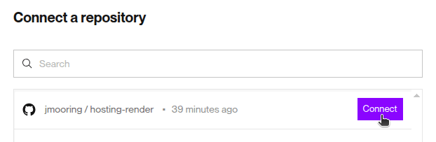
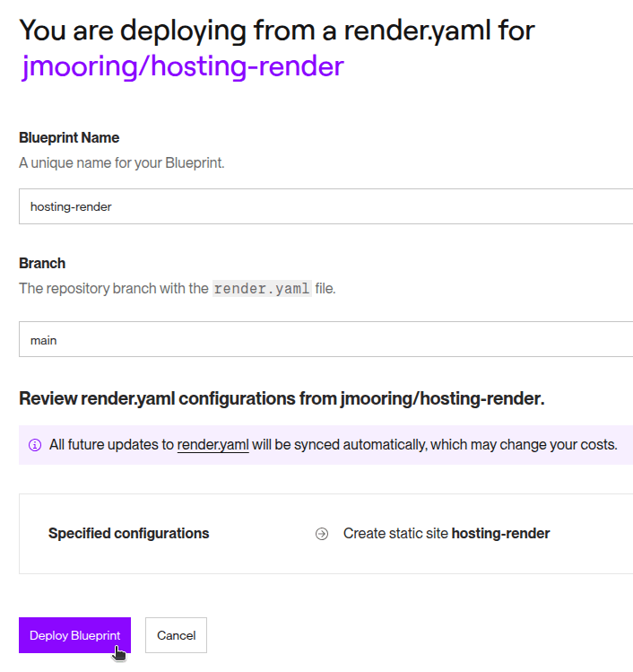
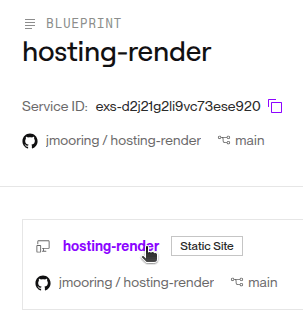
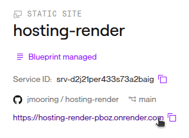

Use these instructions to enable continuous deployment from a GitHub repository. The same general steps apply if you are using Bitbucket or GitLab for version control.

## Prerequisites

Please complete the following tasks before continuing:

1. [Create](https://dashboard.render.com/register) a Render account
1. [Log in](https://dashboard.render.com/login) to your Render account
1. [Create](https://github.com/signup) a GitHub account
1. [Log in](https://github.com/login) to your GitHub account
1. [Create](https://github.com/new) a GitHub repository for your project
1. [Create](https://git-scm.com/docs/git-init) a local Git repository for your project with a [remote](https://git-scm.com/docs/git-remote) reference to your GitHub repository
1. Create a Hugo site within your local Git repository and test it with the `hugo server` command

## Procedure

Step 1
: Create a [Render Blueprint][] in the root of your project.

  ``` {file="render.yaml" copy=true}
  services:
    - type: web
      name: hosting-render
      repo: https://github.com/jmooring/hosting-render
      runtime: static
      buildCommand: chmod a+x build.sh && ./build.sh
      staticPublishPath: public
      envVars:
        - key: DART_SASS_VERSION
          value: 1.90.0
        - key: GO_VERSION
          value: 1.24.5
        - key: HUGO_VERSION
          value: 0.148.2
        - key: NODE_VERSION
          value: 22.18.0
        - key: TZ
          value: Europe/Oslo
  ```

Step 2
: Create a `build.sh` file in the root of your project.

  ```sh {file="build.sh" copy=true}
  #!/usr/bin/env bash

  #------------------------------------------------------------------------------
  # @file
  # Builds a Hugo site hosted on a Render.
  #
  # Render automatically installs Node.js dependencies.
  #------------------------------------------------------------------------------

  main() {

    # Create directory for user-specific executable files
    echo "Creating directory for user-specific executable files..."
    mkdir -p "${HOME}/.local"

    # Install Dart Sass
    echo "Installing Dart Sass ${DART_SASS_VERSION}..."
    curl -sLJO "https://github.com/sass/dart-sass/releases/download/${DART_SASS_VERSION}/dart-sass-${DART_SASS_VERSION}-linux-x64.tar.gz"
    tar -C "${HOME}/.local" -xf "dart-sass-${DART_SASS_VERSION}-linux-x64.tar.gz"
    rm "dart-sass-${DART_SASS_VERSION}-linux-x64.tar.gz"
    export PATH="${HOME}/.local/dart-sass:${PATH}"

    # Install Go
    echo "Installing Go ${GO_VERSION}..."
    curl -sLJO "https://go.dev/dl/go${GO_VERSION}.linux-amd64.tar.gz"
    tar -C "${HOME}/.local" -xf "go${GO_VERSION}.linux-amd64.tar.gz"
    rm "go${GO_VERSION}.linux-amd64.tar.gz"
    export PATH="${HOME}/.local/go/bin:${PATH}"

    # Install Hugo
    echo "Installing Hugo ${HUGO_VERSION}..."
    curl -sLJO "https://github.com/gohugoio/hugo/releases/download/v${HUGO_VERSION}/hugo_extended_${HUGO_VERSION}_linux-amd64.tar.gz"
    mkdir -p "${HOME}/.local/hugo"
    tar -C "${HOME}/.local/hugo" -xf "hugo_extended_${HUGO_VERSION}_linux-amd64.tar.gz"
    rm "hugo_extended_${HUGO_VERSION}_linux-amd64.tar.gz"
    export PATH="${HOME}/.local/hugo:${PATH}"

    # Verify installations
    echo "Verifying installations..."
    echo Dart Sass: "$(sass --version)"
    echo Go: "$(go version)"
    echo Hugo: "$(hugo version)"
    echo Node.js: "$(node --version)"

    # Configure Git
    echo "Configuring Git..."
    git config core.quotepath false
    if [ "$(git rev-parse --is-shallow-repository)" = "true" ]; then
      git fetch --unshallow
    fi

    # Build the site
    echo "Building the site..."
    hugo --gc --minify --baseURL "${RENDER_EXTERNAL_URL}"

  }

  set -euo pipefail
  main "$@"
  ```

Step 3
: Commit the changes to your local Git repository and push to your GitHub repository.

Step 4
: On the Render [dashboard][], press the **Add new** button and select "Blueprint" from the drop-down menu.

  

Step 5
: Press the **GitHub** button to connect to your GitHub account.

  

Step 6
: Press the **Authorize Render** button to allow the Render application to access your GitHub account.

  

Step 7
: Select the GitHub account where you want to install the Render application.

  

Step 8
: Authorize the Render application to access all repositories or only select repositories, then press the **Install** button.


Step 9
: On the "Create a new Blueprint Instance in My Workspacee" page, press the **Connect** button to the right of the name of your GitHub repository.

  

Step 10
: Enter a unique name for your Blueprint, then press the **Deploy Blueprint** button at the bottom of the page.

  

Step 11
: Wait for the site to build and deploy, then click on the "Resources" link on the left side of the page.

  

Step 12
: Click on the link to the static site resource.

  

Step 13
: Click on the link to your published site.

  

In the future, whenever you push a change from your local Git repository, Render will rebuild and deploy your site.

[Render Blueprint]: https://render.com/docs/blueprint-spec
[dashboard]: https://dashboard.render.com/
