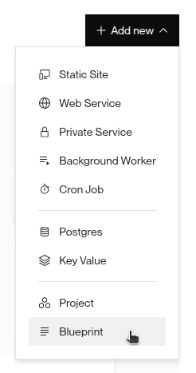
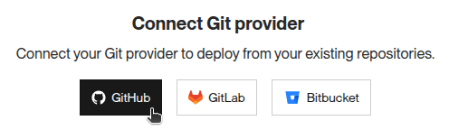
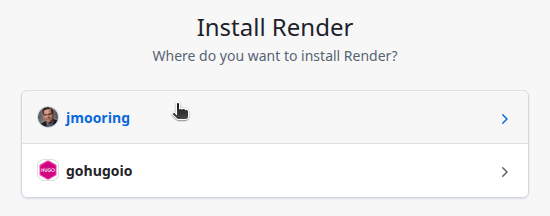
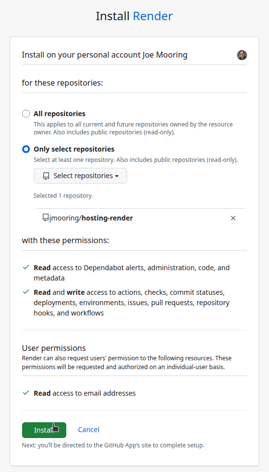
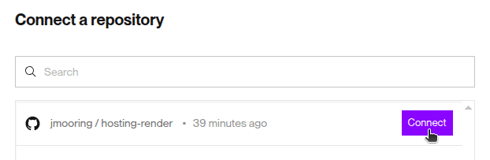
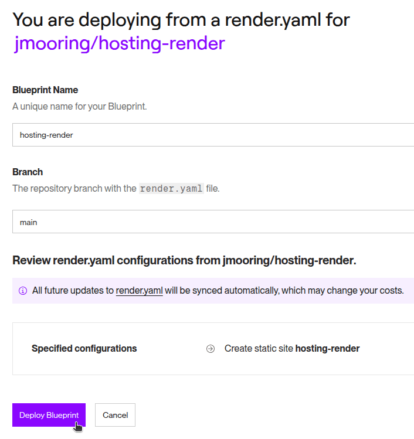
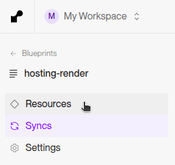
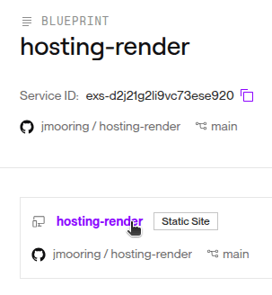
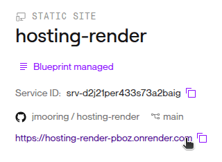

Use these instructions to enable continuous deployment from a GitHub repository. The same general steps apply for other Git providers such as GitLab or Bitbucket.

{}

## Prerequisites

Please complete the following tasks before continuing:

1. [Create](https://dashboard.render.com/register) a Render account.
1. [Log in](https://dashboard.render.com/login) to your Render account.
1. [Create](https://github.com/signup) a GitHub account.
1. [Log in](https://github.com/login) to your GitHub account.
1. [Create](https://github.com/new) a GitHub repository for your project.
1. [Create](https://git-scm.com/docs/git-init) a local Git repository for your project with a [remote][] reference to your GitHub repository.
1. Create a Hugo project within your local Git repository and test it with the `hugo server` command.
1. Commit the changes to your local Git repository and push to your GitHub repository.

## Procedure

Step 1
: Create a `render.yaml` file in the root of your project, adjusting the tool versions and time zone as needed.

  ```yaml {file="render.yaml" copy=true}
  services:
    - type: web
      name: hosting-render
      repo: https://github.com/jmooring/hosting-render
      runtime: static
      buildCommand: chmod a+x build.sh && ./build.sh
      staticPublishPath: public
      envVars:
        - key: DART_SASS_VERSION
          value: 1.101.0
        - key: GO_VERSION
          value: 1.26.4
        - key: HUGO_VERSION
          value: 0.163.3
        - key: NODE_VERSION
          value: 24.16.0
        - key: TZ
          value: Europe/Oslo
  ```

Step 2
: Create a `build.sh` file in the root of your project.

  ```sh {file="build.sh" copy=true}
  #!/usr/bin/env bash

  #------------------------------------------------------------------------------
  # @file
  # Builds a Hugo project hosted on Render.
  #
  # Render automatically installs Node.js and any Node.js dependencies.
  #------------------------------------------------------------------------------

  # Exit on error, undefined variables, or pipe failures
  set -euo pipefail

  # Set the build cache directory
  HUGO_CACHEDIR="${PWD}/.cache/hugo"

  # Perform cleanup
  cleanup() {
    if [[ -n "${build_temp_dir:-}" && -d "${build_temp_dir}" ]]; then
      rm -rf "${build_temp_dir}"
    fi
  }

  # Register the cleanup trap
  trap cleanup EXIT SIGINT SIGTERM

  main() {
    # Export the build cache directory
    export HUGO_CACHEDIR

    # Create a temporary directory for downloads
    build_temp_dir=$(mktemp -d)

    # Create a local tools directory
    mkdir -p "${HOME}/.local"

    # Install Dart Sass
    echo "Installing Dart Sass ${DART_SASS_VERSION}..."
    curl -sfL --output-dir "${build_temp_dir}" -O "https://github.com/sass/dart-sass/releases/download/${DART_SASS_VERSION}/dart-sass-${DART_SASS_VERSION}-linux-x64.tar.gz"
    tar -C "${HOME}/.local" -xf "${build_temp_dir}/dart-sass-${DART_SASS_VERSION}-linux-x64.tar.gz"
    export PATH="${HOME}/.local/dart-sass:${PATH}"

    # Install Go
    if [[ -f "go.mod" ]]; then
      echo "Installing Go ${GO_VERSION}..."
      curl -sfL --output-dir "${build_temp_dir}" -O "https://go.dev/dl/go${GO_VERSION}.linux-amd64.tar.gz"
      tar -C "${HOME}/.local" -xf "${build_temp_dir}/go${GO_VERSION}.linux-amd64.tar.gz"
      export PATH="${HOME}/.local/go/bin:${PATH}"
    fi

    # Install Hugo
    echo "Installing Hugo ${HUGO_VERSION}..."
    curl -sfL --output-dir "${build_temp_dir}" -O "https://github.com/gohugoio/hugo/releases/download/v${HUGO_VERSION}/hugo_${HUGO_VERSION}_linux-amd64.tar.gz"
    mkdir -p "${HOME}/.local/hugo"
    tar -C "${HOME}/.local/hugo" -xf "${build_temp_dir}/hugo_${HUGO_VERSION}_linux-amd64.tar.gz"
    export PATH="${HOME}/.local/hugo:${PATH}"

    # Log tool versions
    echo "Logging tool versions..."
    command -v sass &> /dev/null && echo "Dart Sass: $(sass --version)" || echo "Dart Sass: not installed"
    command -v go &> /dev/null && echo "Go: $(go version)" || echo "Go: not installed"
    command -v hugo &> /dev/null && echo "Hugo: $(hugo version)" || echo "Hugo: not installed"
    command -v node &> /dev/null && echo "Node.js: $(node --version)" || echo "Node.js: not installed"

    # Configure Git
    echo "Configuring Git..."
    git config --global core.quotepath false

    # Fetch full Git history
    if [[ $(git rev-parse --is-shallow-repository) == true ]]; then
      echo "Fetching full Git history..."
      git fetch --unshallow
    fi

    # Initialize Git submodules
    if [[ -f .gitmodules ]]; then
      echo "Initializing Git submodules..."
      git submodule update --init --recursive
    fi

    # Build the project
    echo "Building the project..."
    hugo build --gc --minify
  }

  main "$@"
  ```

Step 3
: In your project configuration, change the location of the image cache to the [`cacheDir`][] as shown below:

  
  [caches.images]
  dir = ':cacheDir/images'
  

  See [configure file caches][] for more information.

Step 4
: Commit the changes to your local Git repository and push to your GitHub repository.

Step 5
: On the Render [dashboard][], press the **Add new** button and select "Blueprint" from the drop-down menu.

  

Step 6
: Press the **GitHub** button to connect to your GitHub account.

  

Step 7
: Press the **Authorize Render** button to allow the Render application to access your GitHub account.

  

Step 8
: Select the GitHub account where you want to install the Render application.

  

Step 9
: Authorize the Render application to access all repositories or only select repositories, then press the **Install** button.

  

Step 10
: On the "Create a new Blueprint Instance in My Workspace" page, press the **Connect** button to the right of the name of your GitHub repository.

  

Step 11
: Enter a unique name for your Blueprint, then press the **Deploy Blueprint** button at the bottom of the page.

  

Step 12
: Wait for the site to build and deploy, then click on the "Resources" link on the left side of the page.

  

Step 13
: Click on the link to the static site resource.

  

Step 14
: Click on the link to your published site.

  

In the future, whenever you push a change from your local Git repository, Render will rebuild and deploy your site.

[`cacheDir`]: /configuration/all/#cachedir
[configure file caches]: /configuration/caches/
[dashboard]: https://dashboard.render.com/
[remote]: https://git-scm.com/docs/git-remote
