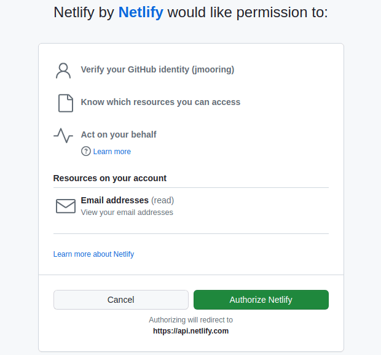
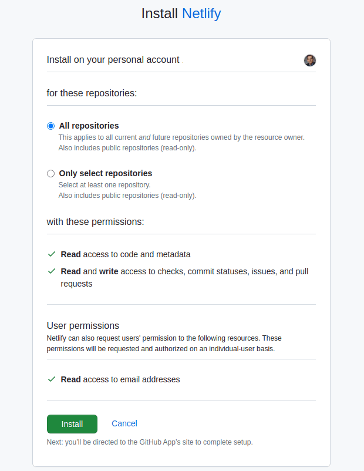
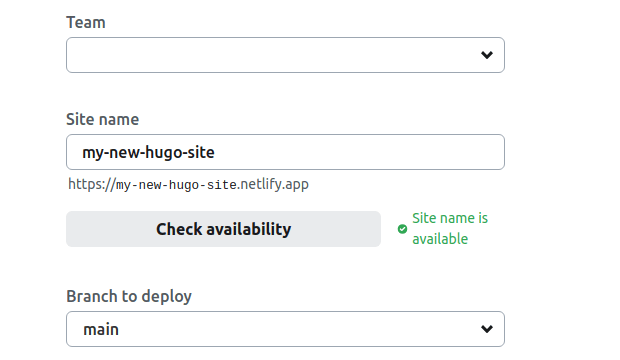

## Prerequisites

1. [Create a Netlify account]
2. [Install Git]
3. [Create a Hugo site] and test it locally with `hugo server`
4. Commit the changes to your local repository
4. Push the local repository to your [GitHub], [GitLab], or [Bitbucket] account

[Bitbucket]: https://bitbucket.org/product
[Create a Hugo site]: /getting-started/quick-start/
[Create a Netlify account]: https://app.netlify.com/signup
[GitHub]: https://github.com
[GitLab]: https://about.gitlab.com/
[Install Git]: https://git-scm.com/book/en/v2/Getting-Started-Installing-Git

## Procedure

This procedure will enable continuous deployment from a GitHub repository. The procedure is essentially the same if you are using GitLab or Bitbucket.

Step 1
: Log in to your Netlify account, navigate to the Sites page, press the **Add new site** button, and choose "Import an existing project" from the dropdown menu.

Step 2
: Select your deployment method.

Step 3
: Authorize Netlify to connect with your GitHub account by pressing the **Authorize Netlify** button.

Step 4
: Press the **Configure Netlify on GitHub** button.

Step 5
: Install the Netlify app by selecting your GitHub account.

Step 6
: Press the **Install** button.

Step 7
: Click on the site's repository from the list.

Step 8
: Set the site name and branch from which to deploy.

Step 9
: Define the build settings, press the **Add environment variables** button, then press the **New variable** button.

Step 10
: Create a new environment variable named `HUGO_VERSION` and set the value to the [latest version].

[latest version]: https://github.com/gohugoio/hugo/releases/latest

Step 11
: Press the "Deploy my new site" button at the bottom of the page.

Step 12
: At the bottom of the screen, wait for the deploy to complete, then click on the deploy log entry.

Step 13
: Press the **Open production deploy** button to view the live site.

## Configuration file

In the procedure above we configured our site using the Netlify user interface. Most site owners find it easier to use a configuration file checked into source control.

Create a new file named netlify.toml in the root of your project directory. In its simplest form, the configuration file might look like this:


[build.environment]
HUGO_VERSION = "0.128.0"
TZ = "America/Los_Angeles"

[build]
publish = "public"
command = "hugo --gc --minify"


If your site requires Dart Sass to transpile Sass to CSS, the configuration file should look something like this:


[build.environment]
HUGO_VERSION = "0.128.0"
DART_SASS_VERSION = "1.77.5"
TZ = "America/Los_Angeles"

[build]
publish = "public"
command = """\
  curl -LJO https://github.com/sass/dart-sass/releases/download/${DART_SASS_VERSION}/dart-sass-${DART_SASS_VERSION}-linux-x64.tar.gz && \
  tar -xf dart-sass-${DART_SASS_VERSION}-linux-x64.tar.gz && \
  rm dart-sass-${DART_SASS_VERSION}-linux-x64.tar.gz && \
  export PATH=/opt/build/repo/dart-sass:$PATH && \
  hugo --gc --minify \
  """

