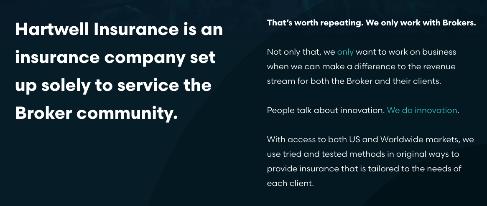

---

title: Hartwell Insurance

date: 2018-02-09

description: "Showcase: \"Hugo + Netlify + PWA makes for a rapid website.\""

siteURL: https://www.hartwell-insurance.com/

byline: "[Trys Mudford](http://www.trysmudford.com), Lead Developer, Tomango"

---

We’ve just launched a shiny new website for [Hartwell Insurance](https://www.hartwell-insurance.com/) – I’m really proud of it. It was tackled in a different way to most previous Tomango site builds, using some fancy new tools and some vintage web standards.

It’s a multi-page, single-page (!) website written in Hugo, a static site generator built with performance as a first-class feature. _I’ve outlined a load of benefits to Hugo & static sites [here](https://why-static.netlify.com/), in case you’re interested._

> **In essence, a static site generator pre-renders the whole site into HTML files and serves them like it’s 1995.**

There’s no Apache or Node backend that does compilation at runtime, it’s all done at the build step. This means the server; Netlify in this case, only has to do one thing – serve files. Unsurprisingly, serving simple files is VERY quick.

The starter point was the [Victor Hugo](https://github.com/netlify/victor-hugo) repository that Netlify have created. It let me dive in with Hugo, PostCSS, Browsersync and ES6 without setting up any tooling myself – always a win!

I then took all the content from the design file and moved it into Markdown, putting shortcodes in where necessary. This site did need a number of custom shortcodes for the presentational elements like the expanding circles and full width backgrounds. But mostly it was just clean, semantic HTML with some CSS and JS enhancement thrown in.

For example, this two column layout shown below. I used CSS Columns with a  `break-after: always;` on the `<h1>`. No multi-wrapper or difficult-to-clear shortcodes, just clean HTML.

For the ripple effects on the section headings, I used JS to prepend a `<canvas>` element then animated it with `RequestAnimationFrame`. It adds a nice bit of movement on the page.

On the Hartwell Profitmaker section, I toyed with the idea of using Vue.js for the calculator, but after giving it some thought, I decided to code in Vanilla. The result, all of the site JS comes in at 3.2KB!

The plan was to host with Netlify and therefore get access to Netlify Forms. It meant spending 0 minutes on getting a backend set up – I could focus fully on the frontend.

Cache invalidation isn’t normally something I spend all that much time thinking about when building a site. But as this site was going to be a Progressive Web App, invalidating files would be important to ensure the site didn’t appear broken when we made changes. As I was using Victor-Hugo, I wasn’t really sure how to best tackle this and sadly spent far too many hours wrangling with Webpack and Gulp files to try and get hashed file names working nicely.

Then; while I was waiting for a haircut, I read a [Netlify blog post](https://www.netlify.com/blog/2017/02/23/better-living-through-caching/) on how they do cache invalidation with HTTP2 and it promptly blew my mind.

When you request an asset, they send an ETag in the headers which is a hash of the file. There’s also a header to tell the browser not to trust it’s own cache (which sounds a little bit bonkers).

So when you request the page, it opens a persistent HTTP2 connection up (so no new connections for file requests). When it gets to requesting that asset, the browser sends the ETag back to Netlify and they either return nothing if the ETag matches, or the new file with the new ETag. No `app.klfjlkdsfjdslkfjdslkfdsj.js` or `app.js?v=20180112`. Just a clean `app.js` with instant cache invalidation. Amazing.

Finally, the [Service Worker](https://www.hartwell-insurance.com/sw.js) could be added. This turned out to be straightforward as the Netlify cache invalidation system solved most of the pain points. I went for a network-first, cache-fallback setup for both assets and HTML. This does mean flaky speeds are reliant on the page connection time, but given we’re on HTTP2, I’m hoping the persistent connection and tiny ETag size will keep it quick. For online connections, every request is up to date and instantly live after any update. Offline connections fall back to every assets’ last cached state. It seems to work really nicely, and there’s no need for an update prompt if assets have changed.

---

## The results

The WebPageTest results are looking good. The speed index is 456, 10x smaller than the average Alexa top 300,000 score.

[TestMySite.io](https://testmysite.io/5a7e1bb2df99531a23c9ad2f/hartwell-insurance.com) is return ~2ms time to first byte from the CDN edge nodes. Lighthouse audits are also very promising. There’s still some improvement to be gained lazy-loading the images and inlining the CSS. I’m less excited about the [second suggestion](http://www.trysmudford.com/css-in-2017/), but I’ll certainly look at some lazy-loading, especially as I’m already using `IntersectionObserver` for some animations.

The most encouraging result is how quick the site is around the world. Most Tomango clients (and their customers) are pretty local and almost exclusively UK-based. We have a dedicated server in Surrey that serves our market pretty well. It did take me by surprise just how much slower a connection from the USA, Australia and Japan to our server was. They’re waiting ~500ms just for the first byte, let alone downloading each asset.

[Hartwell Insurance](https://www.hartwell-insurance.com/) are a US company so by putting them on our server, we’d be instantly hampering their local response times by literally seconds. This was one of the main reasons for going with Netlify. They provide global CDN hosting that’s quick from anywhere in the world.

---

This project was such a blast to develop, it’s a real pleasure to put new technologies to good use in production, and to see real performance and usability benefits from them. Even using classic web methods of serving folders with files is fun when you’ve been using dynamic systems for a while – there’s something really pure about it.

---

_This was originally posted on [my website](http://www.trysmudford.com/perfomance-wins-with-hugo-and-netlify/)_
