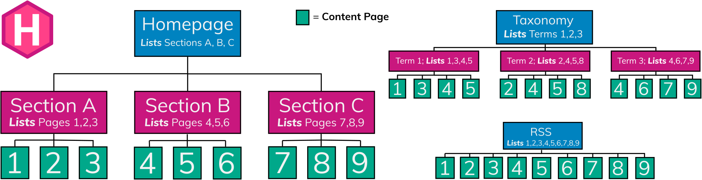

[](site-hierarchy.svg)

## Structure

Create templates in the layouts directory in the root of your project.

Although your site may not require each of these templates, the example below is typical for a site of medium complexity.

```text
layouts/
├── _default/
│   ├── _markup/
│   │   ├── render-image.html   <-- render hook
│   │   └── render-link.html    <-- render hook
│   ├── baseof.html
│   ├── home.html
│   ├── section.html
│   ├── single.html
│   ├── taxonomy.html
│   └── term.html
├── articles/
│   └── card.html               <-- content view
├── partials/
│   ├── footer.html
│   └── header.html
└── shortcodes/
    ├── audio.html
    └── video.html
```

Hugo's [template lookup order] determines the template path, allowing you to create unique templates for any page.

[template lookup order]: /templates/lookup-order/

{}
You must have thorough understanding of the [template lookup order] when creating templates. Template selection is based on template type, page kind, content type, section, language, and output format.

[template lookup order]: /templates/lookup-order/
{}

The purpose of each template type is described below.

## Base

Base templates reduce duplicate code by wrapping other templates within a shell.

For example, the base template below calls the [partial] function to include partial templates for the `head`, `header`, and `footer` elements of each page, and it uses the [block] function to include `home`, `single`, `section`, `taxonomy`, and `term` templates within the `main` element of each page.

[block]: /functions/go-template/block/
[partial]: /functions/partials/include/


<!DOCTYPE html>
<html lang="{{ or site.Language.LanguageCode }}" dir="{{ or site.Language.LanguageDirection `ltr` }}">
<head>
  {{ partial "head.html" . }}
</head>
<body>
  <header>
    {{ partial "header.html" . }}
  </header>
  <main>
    {{ block "main" . }}{{ end }}
  </main>
  <footer>
    {{ partial "footer.html" . }}
  </footer>
</body>
</html>


Learn more about [base templates](/templates/base/).

## Home

A home template renders your site's home page. For a single page site this is the only required template.

For example, the home template below inherits the site's shell from the base template, and renders the home page content with a list of pages.


{{ define "main" }}
  {{ .Content }}
  {{ range site.RegularPages }}
    <h2><a href="{{ .RelPermalink }}">{{ .LinkTitle }}</a></h2>
  {{ end }}
{{ end }}


{}

Learn more about [home templates](/templates/home/).

## Single

A single template renders a single page.

For example, the single template below inherits the site's shell from the base template, and renders the title and content of each page.


{{ define "main" }}
  <h1>{{ .Title }}</h1>
  {{ .Content }}
{{ end }}


Learn more about [single templates](/templates/single/).

## Section

A section template typically renders a list of pages within a section.

For example, the section template below inherits the site's shell from the base template, and renders a list of pages in the current section.


{{ define "main" }}
  <h1>{{ .Title }}</h1>
  {{ .Content }}
  {{ range .Pages }}
    <h2><a href="{{ .RelPermalink }}">{{ .LinkTitle }}</a></h2>
  {{ end }}
{{ end }}


{}

Learn more about [section templates](/templates/section/).

## Taxonomy

A taxonomy template renders a list of terms in a [taxonomy].

[taxonomy]: /getting-started/glossary/#taxonomy

For example, the taxonomy template below inherits the site's shell from the base template, and renders a list of terms in the current taxonomy.


{{ define "main" }}
  <h1>{{ .Title }}</h1>
  {{ .Content }}
  {{ range .Pages }}
    <h2><a href="{{ .RelPermalink }}">{{ .LinkTitle }}</a></h2>
  {{ end }}
{{ end }}


{}

Learn more about [taxonomy templates](/templates/taxonomy/).

## Term

A term template renders a list of pages associated with a [term].

[term]: /getting-started/glossary/#term

For example, the term template below inherits the site's shell from the base template, and renders a list of pages associated with the current term.


{{ define "main" }}
  <h1>{{ .Title }}</h1>
  {{ .Content }}
  {{ range .Pages }}
    <h2><a href="{{ .RelPermalink }}">{{ .LinkTitle }}</a></h2>
  {{ end }}
{{ end }}


{}

Learn more about [term templates](/templates/term/).

## Partial

A partial template is typically used to render a component of your site, though you may also create partial templates that return values.

{}
Unlike other template types, you cannot create partial templates to target a particular page kind, content type, section, language, or output format. Partial templates do not follow Hugo's [template lookup order].

[template lookup order]: /templates/lookup-order/
{}

For example, the partial template below renders copyright information.


<p>Copyright {{ now.Year }}. All rights reserved.</p>


Learn more about [partial templates](/templates/partial/).

## Content view

A content view template is similar to a partial template, invoked by calling the [`Render`] method on a `Page` object. Unlike partial templates, content view templates:

- Automatically inherit the context of the current page
- Follow a lookup order allowing you to target a given content type or section

[`Render`]: /methods/page/render/

For example, the home template below inherits the site's shell from the base template, and renders a card component for each page within the "articles" section of your site.


{{ define "main" }}
  {{ .Content }}
  <ul>
    {{ range where site.RegularPages "Section" "articles" }}
      {{ .Render "card" }}
    {{ end }}
  </ul>
{{ end }}



<div class="card">
  <h2><a href="{{ .RelPermalink }}">{{ .LinkTitle }}</a></h2>
  {{ .Summary }}
</div>


Learn more about [content view templates](/templates/content-view/).

## Render hook

A render hook template overrides the conversion of Markdown to HTML.

For example, the render hook template below adds a `rel` attribute to external links.


{{- $u := urls.Parse .Destination -}}
<a href="{{ .Destination | safeURL }}"
  {{- with .Title }} title="{{ . }}"{{ end -}}
  {{- if $u.IsAbs }} rel="external"{{ end -}}
>
  {{- with .Text | safeHTML }}{{ . }}{{ end -}}
</a>
{{- /* chomp trailing newline */ -}}


Learn more about [render hook templates](/render-hooks/).

## Shortcode

A shortcode template is used to render a component of your site. Unlike partial templates, shortcode templates are called from content pages.

For example, the shortcode template below renders an audio element from a [global resource].

[global resource]: /getting-started/glossary/#global-resource


{{ with resources.Get (.Get "src") }}
  <audio controls preload="auto" src="{{ .RelPermalink }}"></audio>
{{ end }}


Call the shortcode from your content page:





Learn more about [shortcode templates](/templates/shortcode/).

## Other

Use other specialized templates to create:

- [Sitemaps](/templates/sitemap)
- [RSS feeds](/templates/rss/)
- [404 error pages](/templates/404/)
- [robots.txt files](/templates/robots/)
