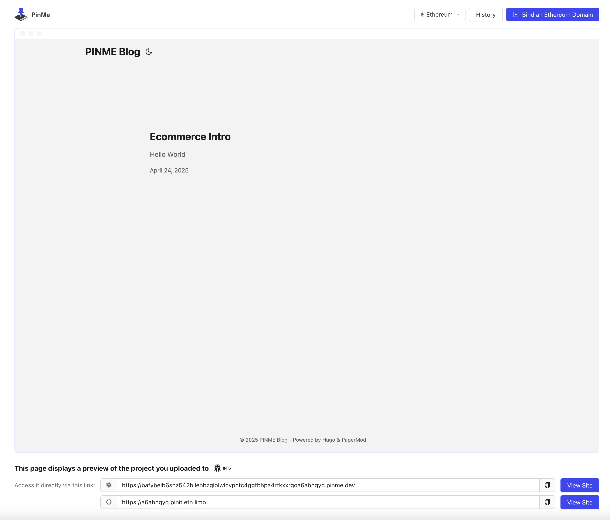

## Assumptions

- A functional static website built with Hugo
- [Node.js](https://nodejs.org) installed on your local machine
- You own an [ENS domain](https://app.ens.domains/)
- You have a Web3 wallet (such as [MetaMask](https://metamask.io/))

## What is ENS & IPFS?

### Ethereum Name Service (ENS)

ENS is a distributed, open, and extensible naming system based on the Ethereum blockchain. It allows you to map human-readable names like 'mywebsite.eth' to machine-readable identifiers such as IPFS hashes, Ethereum addresses, or other content.

### InterPlanetary File System (IPFS)

IPFS is a distributed file system that seeks to connect all computing devices with the same system of files. It's a content-addressed, peer-to-peer hypermedia distribution protocol designed to make the web faster, safer, and more open.

## Advantages of ENS & IPFS for Hugo Sites

- **Decentralized hosting** - Combining IPFS and ENS creates a fully decentralized website
- **Custom domain** - Use your branded .eth domain instead of long IPFS hashes
- **Permanence** - Once the content is on IPFS and linked to ENS, it remains accessible
- **Ownership** - You control your domain and content without intermediaries
- **Censorship resistance** - Your content remains accessible regardless of traditional hosting services

## Deploying Your Site to ENS & IPFS

### Step 1: Install PinMe

First, install the PinMe CLI globally on your machine:

```sh
# Using npm
npm install -g pinme

# Using yarn
yarn global add pinme
```

### Step 2: Build Your Hugo Site

Build your Hugo site with minification:

```sh
hugo --minify
```

This creates a `public` directory containing your static site files.

### Step 3: Deploy to IPFS with PinMe

Deploy your site to IPFS using PinMe:

```sh
pinme upload ./public
```

After the upload completes, PinMe will provide:
1. An IPFS content hash (CID)
2. An accessible URL link to your site

### Step 4: Bind Your IPFS Site to ENS

Follow these steps to bind your IPFS site to your ENS domain:

#### 1. Access Your Deployment Preview

Open the preview link provided by PinMe in your browser.



#### 2. Initiate ENS Binding Process

Click the "Bind an Ethereum Domain" button.


#### 3. Connect Your Wallet

Connect your Web3 wallet and follow the authentication steps.

#### 4. Re-initiate Binding

Click the "Bind an Ethereum Domain" button again.


#### 5. Select Your ENS Domain

Select the domain you want to bind to your IPFS content.


#### 6. Confirm the Binding

Click the "Bind" button and confirm the transaction in your wallet.


#### 7. Complete the Transaction

Approve the transaction and wait for confirmation on the Ethereum blockchain.

#### 8. Binding Complete

Your Hugo site is now accessible via your ENS domain.

## Accessing Your Site

After successful binding, access your site through:

1. **ENS-aware browsers** - Browsers like Brave or Opera can directly access `yourdomain.eth`
2. **Browser extensions** - MetaMask or ENS companion extensions can resolve ENS domains
3. **Public ENS gateways** - `https://yourdomain.eth.limo` or `https://yourdomain.eth.link`

## Managing Your Deployment

### View Deployment History

View your previous uploads:

```sh
pinme list
```

Or use the shorthand:

```sh
pinme ls
```

### Updating Your Site

To update your website:

1. Make changes to your Hugo site locally
2. Rebuild with `hugo --minify`
3. Re-deploy with `pinme upload ./public`
4. Follow the binding process again to update your ENS record

## Troubleshooting

If you encounter issues:

- Ensure your ENS domain has not expired
- Check that you have sufficient ETH for transaction fees
- Verify you're connected with the wallet that owns the ENS domain
- Allow time for ENS updates to propagate (can take up to several minutes)
- Clear browser caches if you're seeing outdated content
