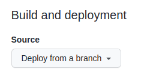
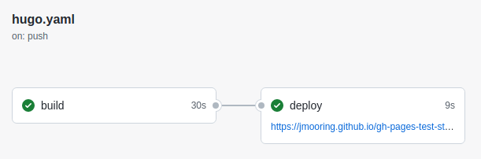

## Types of sites

There are three types of GitHub Pages sites: project, user, and organization. Project sites are connected to a specific project hosted on GitHub. User and organization sites are connected to a specific account on GitHub.com.

> [!note]
> See the [GitHub Pages documentation] to understand the requirements for repository ownership and naming.

## Prerequisites

Please complete the following tasks before continuing:

1. [Create](https://github.com/signup) a GitHub account
1. [Log in](https://github.com/login) to your GitHub account
1. [Create](https://github.com/new) a GitHub repository for your project
1. [Create](https://git-scm.com/docs/git-init) a local Git repository for your project with a [remote](https://git-scm.com/docs/git-remote) reference to your GitHub repository
1. Create a Hugo site within your local Git repository and test it with the `hugo server` command
1. Commit the changes to your local Git repository and push to your GitHub repository

## Procedure

Step 1
: Visit your GitHub repository. From the main menu choose **Settings**&nbsp;>&nbsp;**Pages**. In the center of your screen you will see this:

  

  Change the **Source** to `GitHub Actions`. The change is immediate; you do not have to press a Save button.

  

Step 2
: In your site configuration, change the location of the image cache to the [`cacheDir`] as shown below:

  
  [caches.images]
  dir = ":cacheDir/images"
  

  See [configure file caches] for more information.

Step 3
: Create a file named `hugo.yaml` in a directory named `.github/workflows`.

  ```text
  mkdir -p .github/workflows
  touch .github/workflows/hugo.yaml
  ```

Step 4
: Copy and paste the YAML below into the file you created.

  ```yaml {file=".github/workflows/hugo.yaml" copy=true}
  name: Build and deploy
  on:
    push:
      branches:
        - main
    workflow_dispatch:
  permissions:
    contents: read
    pages: write
    id-token: write
  concurrency:
    group: pages
    cancel-in-progress: false
  defaults:
    run:
      shell: bash
  jobs:
    build:
      runs-on: ubuntu-latest
      env:
        DART_SASS_VERSION: 1.90.0
        GO_VERSION: 1.24.5
        HUGO_VERSION: 0.148.2
        NODE_VERSION: 22.18.0
        TZ: Europe/Oslo
      steps:
        - name: Checkout
          uses: actions/checkout@v5
          with:
            submodules: recursive
            fetch-depth: 0
        - name: Setup Go
          uses: actions/setup-go@v5
          with:
            go-version: ${{ env.GO_VERSION }}
            cache: false
        - name: Setup Node.js
          uses: actions/setup-node@v4
          with:
            node-version: ${{ env.NODE_VERSION }}
        - name: Setup Pages
          id: pages
          uses: actions/configure-pages@v5
        - name: Create directory for user-specific executable files
          run: |
            mkdir -p "${HOME}/.local"
        - name: Install Dart Sass
          run: |
            curl -sLJO "https://github.com/sass/dart-sass/releases/download/${DART_SASS_VERSION}/dart-sass-${DART_SASS_VERSION}-linux-x64.tar.gz"
            tar -C "${HOME}/.local" -xf "dart-sass-${DART_SASS_VERSION}-linux-x64.tar.gz"
            rm "dart-sass-${DART_SASS_VERSION}-linux-x64.tar.gz"
            echo "${HOME}/.local/dart-sass" >> "${GITHUB_PATH}"
        - name: Install Hugo
          run: |
            curl -sLJO "https://github.com/gohugoio/hugo/releases/download/v${HUGO_VERSION}/hugo_extended_${HUGO_VERSION}_linux-amd64.tar.gz"
            mkdir "${HOME}/.local/hugo"
            tar -C "${HOME}/.local/hugo" -xf "hugo_extended_${HUGO_VERSION}_linux-amd64.tar.gz"
            rm "hugo_extended_${HUGO_VERSION}_linux-amd64.tar.gz"
            echo "${HOME}/.local/hugo" >> "${GITHUB_PATH}"
        - name: Verify installations
          run: |
            echo "Dart Sass: $(sass --version)"
            echo "Go: $(go version)"
            echo "Hugo: $(hugo version)"
            echo "Node.js: $(node --version)"
        - name: Install Node.js dependencies
          run: |
            [[ -f package-lock.json || -f npm-shrinkwrap.json ]] && npm ci || true
        - name: Configure Git
          run: |
            git config core.quotepath false
        - name: Cache restore
          id: cache-restore
          uses: actions/cache/restore@v4
          with:
            path: ${{ runner.temp }}/hugo_cache
            key: hugo-${{ github.run_id }}
            restore-keys:
              hugo-
        - name: Build the site
          run: |
            hugo \
              --gc \
              --minify \
              --baseURL "${{ steps.pages.outputs.base_url }}/" \
              --cacheDir "${{ runner.temp }}/hugo_cache"
        - name: Cache save
          id: cache-save
          uses: actions/cache/save@v4
          with:
            path: ${{ runner.temp }}/hugo_cache
            key: ${{ steps.cache-restore.outputs.cache-primary-key }}
        - name: Upload artifact
          uses: actions/upload-pages-artifact@v3
          with:
            path: ./public
    deploy:
      environment:
        name: github-pages
        url: ${{ steps.deployment.outputs.page_url }}
      runs-on: ubuntu-latest
      needs: build
      steps:
        - name: Deploy to GitHub Pages
          id: deployment
          uses: actions/deploy-pages@v4
  ```

Step 5
: Commit the changes to your local Git repository and push to your GitHub repository.

Step 6
: From GitHub's main menu, choose **Actions**. You will see something like this:

  

Step 7
: When GitHub has finished building and deploying your site, the color of the status indicator will change to green.

  

Step 8
: Click on the commit message as shown above. Under the deploy step, you will see a link to your live site.

  

In the future, whenever you push a change from your local Git repository, GitHub Pages will rebuild and deploy your site.

## Customize the workflow

The example workflow above includes this step, which typically takes 10&#8209;15 seconds:

```yaml
- name: Install Dart Sass
  run: sudo snap install dart-sass
```

You may remove this step if your site, themes, and modules do not transpile Sass to CSS using the [Dart Sass] transpiler.

## Other resources

- [Learn more about GitHub Actions](https://docs.github.com/en/actions)
- [Caching dependencies to speed up workflows](https://docs.github.com/en/actions/using-workflows/caching-dependencies-to-speed-up-workflows)
- [Manage a custom domain for your GitHub Pages site](https://docs.github.com/en/pages/configuring-a-custom-domain-for-your-github-pages-site/about-custom-domains-and-github-pages)

[`cacheDir`]: /configuration/all/#cachedir
[configure file caches]: /configuration/caches/
[Dart Sass]: /functions/css/sass/#dart-sass
[GitHub Pages documentation]: https://docs.github.com/en/pages/getting-started-with-github-pages/about-github-pages#types-of-github-pages-sites
