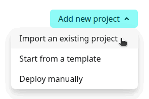
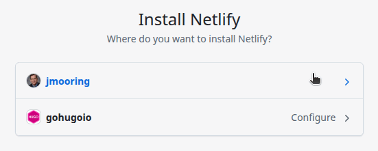
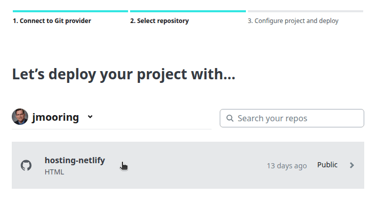
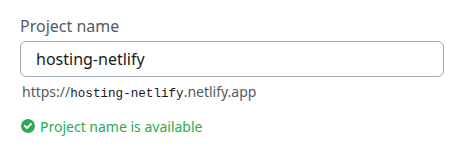

Use these instructions to enable continuous deployment from a GitHub repository. The same general steps apply if you are using Azure DevOps, Bitbucket, or GitLab for version control.

## Prerequisites

Please complete the following tasks before continuing:

1. [Create](https://app.netlify.com/signup) a Netlify account
1. [Log in](https://app.netlify.com/login) to your Netlify account
1. [Create](https://github.com/signup) a GitHub account
1. [Log in](https://github.com/login) to your GitHub account
1. [Create](https://github.com/new) a GitHub repository for your project
1. [Create](https://git-scm.com/docs/git-init) a local Git repository for your project with a [remote](https://git-scm.com/docs/git-remote) reference to your GitHub repository
1. Create a Hugo site within your local Git repository and test it with the `hugo server` command
1. Commit the changes to your local Git repository and push to your GitHub repository.

## Procedure

<!-- Using "text" as the code block language because "toml" looks terrible. -->

Step 1
: Create a `netlify.toml` file in the root of your project.

  ```text {file="netlify.toml" copy=true}
  [build.environment]
  DART_SASS_VERSION = "1.96.0"
  GO_VERSION = "1.25.5"
  HUGO_VERSION = "0.152.2"
  NODE_VERSION = "24.12.0"
  TZ = "Europe/Oslo"

  [build]
  publish = "public"
  command = """\
    git config core.quotepath false && \
    hugo --gc --minify --baseURL "${URL}"
    """
  ```

  If your site requires Dart Sass to transpile Sass to CSS, set the `DART_SASS_VERSION` and include the Dart Sass installation in the build step.

  ```text {file="netlify.toml" copy=true}
  [build.environment]
  DART_SASS_VERSION = "1.96.0"
  GO_VERSION = "1.25.5"
  HUGO_VERSION = "0.152.2"
  NODE_VERSION = "24.12.0"
  TZ = "Europe/Oslo"

  [build]
  publish = "public"
  command = """\
    curl -sLJO "https://github.com/sass/dart-sass/releases/download/${DART_SASS_VERSION}/dart-sass-${DART_SASS_VERSION}-linux-x64.tar.gz" && \
    tar -C "${HOME}/.local" -xf "dart-sass-${DART_SASS_VERSION}-linux-x64.tar.gz" && \
    rm "dart-sass-${DART_SASS_VERSION}-linux-x64.tar.gz" && \
    export PATH="${HOME}/.local/dart-sass:${PATH}" && \
    git config core.quotepath false && \
    hugo --gc --minify --baseURL "${URL}"
    """
  ```

Step 2
: Commit the changes to your local Git repository and push to your GitHub repository.

Step 3
: In the upper right corner of the Netlify dashboard, press the **Add new project** button and select “Import an existing project".

  

Step 4
: Connect to GitHub.

  

Step 5
: Press the "Authorize Netlify" button to allow the Netlify application to access your GitHub account.

  

Step 6
: Press the **Configure Netlify on GitHub** button.
  
  

Step 7
: Select the GitHub account where you want to install the Netlify application.

  

Step 8
: Authorize the Netlify application to access all repositories or only select repositories, then press the Install button.

  

Your browser will be redirected to the Netlify dashboard.

Step 9
: Click on the name of the repository you wish to import.

  

Step 10
: On the "Review configuration" page, enter a project name, leave the settings at their default values, then press the **Deploy** button.

  

  

Step 11
: When the deployment completes, click on the link to your published site.

  

In the future, whenever you push a change from your local Git repository, Netlify will rebuild and deploy your site.
