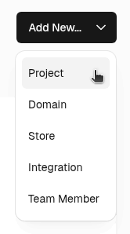
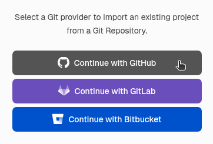
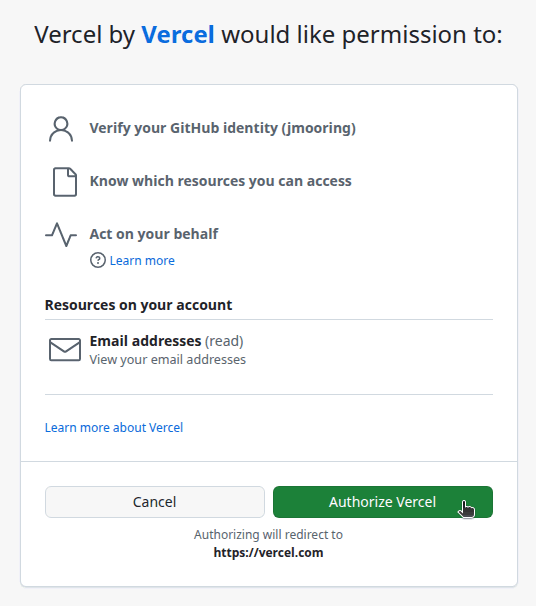
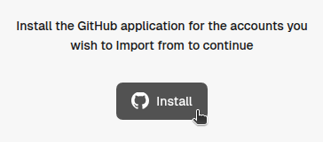
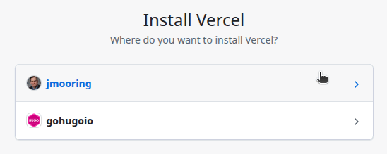
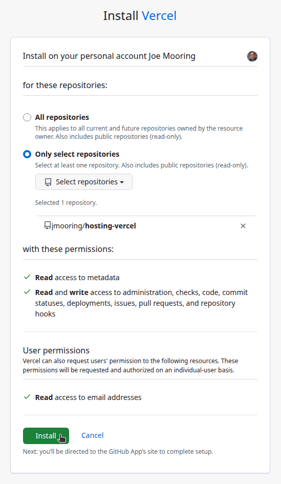
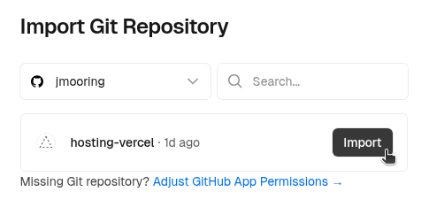
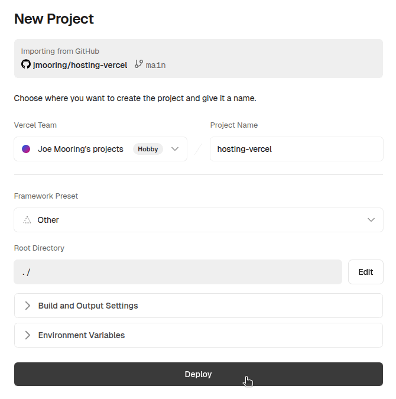
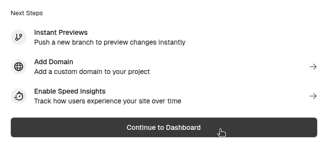
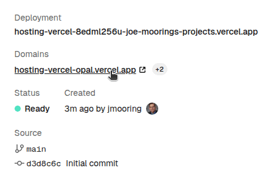

Use these instructions to enable continuous deployment from a GitHub repository. The same general steps apply if you are using Bitbucket or GitLab for version control.

## Prerequisites

Please complete the following tasks before continuing:

1. [Create](https://vercel.com/signup) a Vercel account
1. [Log in](https://vercel.com/login) to your Vercel account
1. [Create](https://github.com/signup) a GitHub account
1. [Log in](https://github.com/login) to your GitHub account
1. [Create](https://github.com/new) a GitHub repository for your project
1. [Create](https://git-scm.com/docs/git-init) a local Git repository for your project with a [remote](https://git-scm.com/docs/git-remote) reference to your GitHub repository
1. Create a Hugo site within your local Git repository and test it with the `hugo server` command

## Procedure

Step 1
: Create a `vercel.json` file in the root of your project.

  ```json {file="vercel.json" copy=true}
  {
    "$schema": "https://openapi.vercel.sh/vercel.json",
    "buildCommand": "chmod a+x build.sh && ./build.sh",
    "outputDirectory": "public"
  }
  ```

Step 2
: Create a `build.sh` file in the root of your project.

  ```sh {file="build.sh" copy=true}
  #!/usr/bin/env bash

  #------------------------------------------------------------------------------
  # @file
  # Builds a Hugo site hosted on Vercel.
  #
  # The Vercel build image automatically installs Node.js dependencies.
  #------------------------------------------------------------------------------

  main() {

    DART_SASS_VERSION=1.90.0
    GO_VERSION=1.24.5
    HUGO_VERSION=0.148.2
    NODE_VERSION=22.18.0

    export TZ=Europe/Oslo

    # Install Dart Sass
    echo "Installing Dart Sass ${DART_SASS_VERSION}..."
    curl -sLJO "https://github.com/sass/dart-sass/releases/download/${DART_SASS_VERSION}/dart-sass-${DART_SASS_VERSION}-linux-x64.tar.gz"
    tar -C "${HOME}/.local" -xf "dart-sass-${DART_SASS_VERSION}-linux-x64.tar.gz"
    rm "dart-sass-${DART_SASS_VERSION}-linux-x64.tar.gz"
    export PATH="${HOME}/.local/dart-sass:${PATH}"

    # Install Go
    echo "Installing Go ${GO_VERSION}..."
    curl -sLJO "https://go.dev/dl/go${GO_VERSION}.linux-amd64.tar.gz"
    tar -C "${HOME}/.local" -xf "go${GO_VERSION}.linux-amd64.tar.gz"
    rm "go${GO_VERSION}.linux-amd64.tar.gz"
    export PATH="${HOME}/.local/go/bin:${PATH}"

    # Install Hugo
    echo "Installing Hugo ${HUGO_VERSION}..."
    curl -sLJO "https://github.com/gohugoio/hugo/releases/download/v${HUGO_VERSION}/hugo_extended_${HUGO_VERSION}_linux-amd64.tar.gz"
    mkdir "${HOME}/.local/hugo"
    tar -C "${HOME}/.local/hugo" -xf "hugo_extended_${HUGO_VERSION}_linux-amd64.tar.gz"
    rm "hugo_extended_${HUGO_VERSION}_linux-amd64.tar.gz"
    export PATH="${HOME}/.local/hugo:${PATH}"

    # Install Node.js
    echo "Installing Node.js ${NODE_VERSION}..."
    curl -sLJO "https://nodejs.org/dist/v${NODE_VERSION}/node-v${NODE_VERSION}-linux-x64.tar.xz"
    tar -C "${HOME}/.local" -xf "node-v${NODE_VERSION}-linux-x64.tar.xz"
    rm "node-v${NODE_VERSION}-linux-x64.tar.xz"
    export PATH="${HOME}/.local/node-v${NODE_VERSION}-linux-x64/bin:${PATH}"

    # Verify installations
    echo "Verifying installations..."
    echo Dart Sass: "$(sass --version)"
    echo Go: "$(go version)"
    echo Hugo: "$(hugo version)"
    echo Node.js: "$(node --version)"

    # Configure Git
    echo "Configuring Git..."
    git config core.quotepath false
    if [ "$(git rev-parse --is-shallow-repository)" = "true" ]; then
      git fetch --unshallow
    fi

    # Build the site
    echo "Building the site"
    hugo --gc --minify --baseURL "https://${VERCEL_PROJECT_PRODUCTION_URL}"

  }

  set -euo pipefail
  main "$@"
  ```

Step 3
: Commit the changes to your local Git repository and push to your GitHub repository.

Step 4
: In the upper right corner of the Vercel dashboard, press the **Add New** button and select "Project" from the drop down menu.

  

Step 5
: Press the "Continue with GitHub" button.

  

Step 6
: Press the **Authorize Vercel** button to allow the Vercel application to access your GitHub account.

  

Step 7
: Press the **Install** button to install the Vercel application.

  

Step 8
: Select the GitHub account where you want to install the Vercel application.

  

Step 9
: Authorize the Vercel application to access all repositories or only select repositories, then press the **Install** button.

  

  Your browser will be redirected to the Cloudflare dashboard.

Step 10
: Press the **Import** button to the right of the name of your GitHub repository.

  

Step 11
: On the "New Project" page, leave the settings at their default values and press the **Deploy** button.

  

Step 12
: When the deployment completes, press the **Continue to Dashboard" button at the bottom of the page.

  

Step 13
: On the "Production Deployment" page, click on the link to your published site.

  

In the future, whenever you push a change from your local Git repository, Vercel will rebuild and deploy your site.
